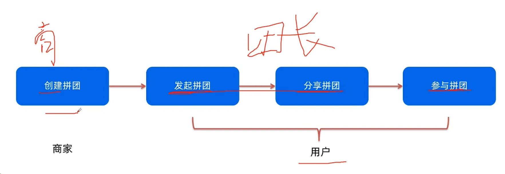
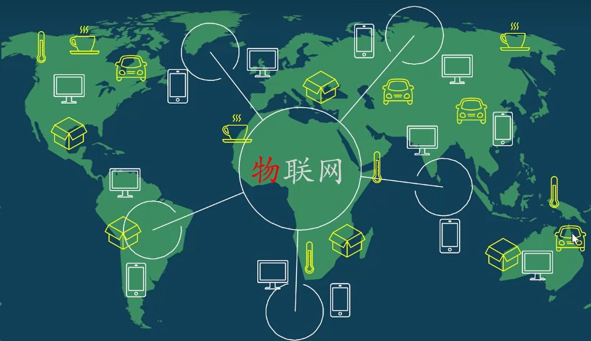

# 23/12

> 营销学习.

1，AARRR（海盗模型）
获取用户 A——提高活跃度 A——提高留存率 R——获取收入 R——病毒式传播 R

2，营销方式是我的手段，为了达到你的AARRR的目的；

3，左侧是目的，右侧是方法；

4，营销中心就是包含很多营销活动的模块集合，专为营销目的做的一个功能，统一管理营销活动，实现营销目标；

5，商家和平台都希望做营销活动，目的是获得新用户提高订单量，有的可以同时满足AARRR；

> 拼团活动.

1，拼团解决拉新和转化问题、减少用户查找商品以及甄别商品的时间成本、以更低价格买到同样的商品、核心目的是获取更多用户；

2，拼团涉及哪些角色参与（平台或商家提供活动、发起人发起活动、被邀请人参加活动）；

3，平台活动案例

拼团有效期为了是给用户压迫感，达到集中曝光效果；拼团人数少，为了降低难度，完成目标现实性；

4，拼团设计思路，创建拼团就是物，后台就要有物管理。

如何做拼团？
角色：商家、团长、团员。
流程：商家创建活动、团长发起拼团、团长分享拼团、团员参加（允许团员也可以分享这个订单）；

5，ID自动生成；活动平台选择发布在哪个平台为了引导流量，小程序为了往APP流量；发起人群目的是对用户的精细化运营（新用户转化率、老用户VIP用户回馈）；参与人群目的是用户精细化运营；成团人数保证用户门槛低一点；有效期是为了制造压迫感；模拟成团是马甲管理，给真实用户制造假象有人跟他拼团了，是否允许模拟成团的功能；活动商品是商品选择，活动信息和已有商品信息关联；拼团价格要单独设置；活动库存就是拼团库存；

6，

一，商家创建活动：活动管理、活动列表、活动新增；

页面故事：哪些商品参加本次拼团活动、活动规则是什么？

新增页：信息（商品信息、活动基本信息、活动规则信息）、功能（选择活动商品、编辑/输入基本信息和规则信息）；

基本信息：活动名称、开始时间、结束时间、活动平台（为什么做，对不同端的导流，比如将流量从小程序导入APP）、发起/参加人群（为什么做：满足精细化运营的需求，比如引导新用户下首单、给vip用户的福利回馈）；

规则信息：成团人数（为什么做：引导用户的行为，鼓励用户去分享）、成团有效期（为什么做：给用户压迫感）、虚拟成团（为什么做：在保证拉新的基础上，提高订单量）；

商品信息：选择已有的商品；

成团人数：默认两人不是两人做判断不可提交；有效期：需要提示和单位，用文案引导；模拟成团：进行中凑人，随机凑，比如结束前1h内，随机挑个时间，凑早了没分享动力，不影响成单和曝光，不要固定时间会让用户发生规律；

选择商品是要选择具体SKU的，点选择就是选择商品的SKU，确认取消具体的sku；已下架和已售罄去掉默认展示上架中的商品；拼团价和库存在这个界面决定拼团商品的内容，可编辑和输入；删除是从活动中删除不是下架商品；拼团设置库存是为了控制成本，先判断商品总库存再判断原价商品库存，然后再看拼团现有的库存；
，

拼团活动列表，开团数量：有多少人发起开团；成团数量：拼团成功的数量；什么时间发起什么活动，活动取得什么效果；查询区：状态展示尽量不用下拉。已失效就是未开始的不想玩了直接关闭掉。还有可能有待审核草稿等状态；

二，团长发起拼团

页面：商品详情页发起拼团；是否针对当前商品发起过拼团，就不让发了。执行普通的支付流程；
，

三，团长分享拼团

分享流程：找到拼团订单、查看拼团详情、发起分享；

找到订单：页面，查看拼团订单详情、订单信息，功能是查看拼团详情；

查看拼团详情：页面拼团详情页面，信息是拼团信息，谁参加了拼团，有效时间信息，功能就是发起分享；

发起分享：查看详情页页面支持分享操作；

四，团员参团，一般设计是在H5页面直接完成登录。刚开始降低门槛；

流程：点击分享连接、注册登录、参团、支付、得到订单；

点击分享连接：从好友分享的链接入口点击进入；

注册登录：页面，参团邀请页面（商品信息、参团信息、团长信息，团员信息、时间信息、功能点击参团），用户点击参团，先提示注册登录；参团/支付/得到订单：登录后点击参团完成支付，得到订单；

团员分享：提高拼团成功率，扩大推广量；
，，

7，页面内容，用户端是APP端；

分享出去后要单独画H5端的页面，包含拼团详情、以浏览器模式打开，H5页面就是关闭键，有个弹窗进行注册登录然后编辑订单支付。和APP页面相同，支付成功页面、订单详情、拼团详情，在H5页面需要完成完整的闭环；

APP里面直接参团，在商品详情页面，方便用户拼团不用团长挨个发布，亮点；

拼团状态不同展示内容不同，操作不同；

用户发起拼团算个事，用户活动产生的事情，后台会有用户拼团的记录，页面展示拼团列表；针对什么商品，那个用户什么时候成团人数；查看主要是哪个用户发起拼团等信息、收货地址、参团人数、昵称；高聚合低耦合原则；拼团列表是所有发起的拼团，列表可以加个拼团活动也就是活动名称，拼团列表可以共用，在当前条目里可以直接共用过滤后的拼团列表，当前活动下的拼团列表不用做很多页面；拼团列表可以加个活动名称；

如何区分是否为拼团订单，普通和拼团订单管理，表做区分，高聚合低耦合管理；

默认页面样式、拼团页面样式。初始化样式当有了拼团信息就有可能为空的情况

当团长分享的链接自己打开时的样式，原始样式相同，未登录不能判断谁是团长和团员，一登录根据手机号码判断谁是团长团员，如果是团长这里变为分享拼团，如果是团员显示参与拼团；页面之间的关系和数据判断；两个角色的职责分工，

> 满减满赠活动

1，核心场景

用户，当购买商品时达到一定的优惠门槛了，能够使得订单实付金额产生优惠，优惠的方式可以是现金（满减）也可以是赠品商家（满赠）——占小便宜、价格优势；

商家，相当于商家自己补贴，在原价基础上做了优惠或者说以赠品的方式来吸引用户，但用户也不是无条件享受优惠，用户需要去凑单要么通过购买更多数量的商品要么和其他商品一起凑单——提升销量、提升客单价；

2，设计思路
满减流程：商家创建活动、用户参与活动
    商家创建活动
        满减活动管理：活动列表页、活动新增页
信息：基本信息、商品信息、规则信息（变量：阶梯、每个阶梯的满减条件、每个阶梯的满减优惠）
直接满减就没有阶梯，点击选择商品到商品列表和搜索选择到具体的SKU，拼团价删掉，关联阶梯就是为了让某些商品多买点，关联到具体的价格阶梯使操作更加灵活。每满减活动可以叠加享受，遇到的比较少；

活动列表，满X元减。满X件减的，打几折这种优惠；在选择优惠类型时候要支持条件选择；

满减活动页面

变量规则

如果涉及的金额到小数点后三位的话，是四舍五入还是取整还是保留小数点后两位？但凡涉及到钱的计算就不要擅自做主，需要会议讨论容易要不容易背锅；

> 前端知识

前端三要素：html（页面结构和内容）、css（页面的样式）、javaScript（页面行为控制）；

CSS：标记型语言，不能编程；

CSS预处理器：编程语言，会通过web页面设计再通过编译器转化成正常的css文件，以供项目使用。预处理器有saas和less（用的多）；

JavaScript（JS）：Native原生Js开发，也就是让我们按照ES标准的的开发方式，特点是所有的浏览器都支持；

JS构建工具：Webpack打包工具，把ES6写的语法打包编译成ES5的语法。Bable JS编译工具，主要用于浏览器不支持的ES新特性，比如TypeScript；

TypeScript：是JS的超集微软开发的，用的人也很多但是不在ES标准范围内导致很多浏览器不能直接支持该语法，需要编译成JS才能被执行；

JS框架：jQuery（DOM操作频繁，影响前端性能，只为兼容IE6、7、8）—— Angular（MVC模式模块化迭代不合理） —— React（虚拟DOM需要学习JSX语言） —— Vue（渐进式JavaScript框架，逐步实现新特性的意思、模块化开发、虚拟DOM、视图层框架、没有通讯能力）；

Axios：前端通信框架将最底层的东西（url、http、request）封装起来的一个框架，是阿贾克斯请求库；

UI框架：Ant-Design阿里巴巴出品基于React的UI框架、ElementUI饿了么出品基于Vue的UI框架、Bootstrap：Twitter推出的前端开发的开源工具包、AmazeUI妹子UI，一款HTML5跨屏前端框架；

同步和异步：同步是按照顺序的步骤进行的必须一个步骤有结果后才会去做第二件事情；异步是不强关联的事情可以一起做，我去做第一件事情不用等结果就可以干第二件事情；

阿贾克斯的作用：阿贾克斯是拉后台数据的，不用页面跳转，可以向后台可以发多个请求，后台可以提供多个数据；

请求：get请求参数在url后面就是get请求是可见的（不重要数据），不修改增加数据不影响资源内容。post请求数据是在body里面是不可见的（发送数据不可见），会改变数据种类和资源，几乎所有的提交内容都用它。DELETE删除数据资源。put会改变数据库信息、修改数据库内容，不增加数据种类。（请求不会改变数据库的内容都是人为改变的，只是Restful规范就是通过http协议执行相应动作操作它，如get、post、put、patch、delete）；

> 低代码实现逻辑

狭义定义：就是将组件以可视化编排配置的方式生产页面的能力。可应用场景包含中后台页面、小程序、移动端、流程图（不写特殊配置文件）、数据报表等；

低代码特点：可视化GUI、低门槛、快速交付等；

低代码技术解析：将组件以可视化交互方式编排成想要的布局和配置，并将配置结果以某种方式渲染出来；

需求分解：需要是普通的前端组件、设置面板（可配置）和组件属性对应关系。如何实现可视化编排也就是拖拉拽，实现后如何还原成页面；

关键技术方案：可复用标准组件库和沉淀组件库，要求设置面板可配置；

配置包含：映射到源码如何使用组件开发——组件属性、组件回调函数。设置面板布局显示相关——以什么UI交互形式（下拉/输入框）给属性/回调赋值，设置面板是否可以对布局进行调整（分组，是否显示某属性）。以什么格式描述JSON；

物料就是在讲组件的意思；

如何实现可视化编排，编排结果能还原成页面就是HTML源生的API把一个可拖拽的元素拖到一个可以放置到的位置上；

拖拽过程中，实际上拖拽的是一段配置也就是对于一个组件的描述，画布里背后是有一个结构描述的比如上面有个输入框中间有个按钮下面有两张表格，这份描述我们称之为数据模型，整个画布区域的展示都是对这个模型的反馈。拖动时候会在程序中记录拖动的元素是什么，放置什么位置是依据一定的规则去计算的，比如可能按照某个组件的右上角作为计算点进行预测可能放置的位置。松开鼠标片段就插到背后的数据模型里然后就形成一个新的数据模型。模型更新后把画布渲染刷新达成最终效果。从模型描述里解析提取出来你用了哪些组件加载组件按照特定结构渲染出来；

协议栈（定义术语、结构和行为）：组件加组件属性加上布局如何去描述成一个json把他存下来，描述的规范叫做低代码引擎搭建协议规范。对于每个组件它的设置面板长什么样子有哪些特性如何布局叫做低代码引擎物料协议规范。我要引进我的100个组件，每个组件都有哪些基本配置，面板是以什么分类显示的，物料引进也要有个描述叫做低代码引擎资产协议规范；

架构设计：入料，将外部的物料按照物料协议规范进行描述，并通过编排的API注册后在编辑器中使用。编排，在编辑器中使用生成搭建协议规范的内容，将设计器中的所有物料进行布局设置、组件设置、交互设置等转换成协议。渲染，将编排生成的搭建协议渲染成视图的过程，视图是可以交互的，所以必须处理好内部数据流、生命周期、事件绑定、国际化等等。出码，将搭建协议规范转成应用代码的机制；

前置知识：前端基础HTML、JS和React框架基础知识；

中后台前端的武器-组件化（开发可直接复用一些东西）：组件丰富全面、开箱即用、默认多端适配、丰富模板、动态主题；

> 物联网iot方面的学习

摄像头的日活跃用户数10w，日在线设备数5W，总用户数20w，总设备数10w。3个月研发到上线；

物联网（IoT）：Internet Of Things世间万物互联；

开发板（乐鑫科技）：TX是向外发送数据、RX通过窗口接收数据。D2那一圈是引脚名。以GPIO开头的是通用输入输出的意思，GPIO4指的是4号通用输入输出引脚。蓝底白字是芯片引脚名称，D2是开发板引脚名称是数字引脚。A0是模拟引脚ADC代表模拟引脚只有一个（模拟引脚电压是0-1v范围）。RST就是复位的意思，FLASH刷固件时候会用到操作比较复杂；

互联网协议：设备通讯交流的语言就是TCP/IP协议;

TCP和IP协议包含，应用层，HTTP，FTP,mDNS,WebSocket，OSC...，传输层，TCP，UDP,网络层，IP，链路层也叫网络接口层，Ethernet,Wi-Fi...;

每一层的作用：

链路层，主要作用是实现设备之间的物理（设备和网络连接）链接。WiFi联网三种工作模式。接入点模式、无线终端模式、混合模式；

网络层，IP地址，为网络设备提供地址功能，互联网就是实现信息传输的，把信息打成数据包，像快递包，IP地址就相当于发送接收地址。包含两个版本IPV4和IPV6；

在局域网里的IP地址。WiFi路由器就是网关，网关就是连接网络与网络之间的关口，WiFi路由器建立的局域网中，图上的IP地址只是局域网的地址，互联网的IP地址不是图上的IP地址，中国联通会重新发布一个新地址给这些设备；

传输层，TCP协议（电子邮件/文件传输等）,UDP协议（在线语音/视频/网游等）。TCP特点是稳，保证所有的数据都能被接收端接收，数据的传输顺序不会打乱，传输数据如有损坏则重发受损数据，传输速度慢些。UDP协议比TCP快，但是不保证所有数据都能被接收端接收，数据一旦受损UDP协议将抛弃受损数据，数据受损后不会重发受损数据。

应用层，HTTP协议是由请求和响应构成，同比一问一答。请求包含获取信息get，发送信息post。响应包含；

开发板如何处理http的请求和响应，需要依赖开发板的控制程序；

www信息如何转化成IP地址信息的，他需要将网址先发送到DNS服务器上，然后DNS检索转化成IP地址，然后DNS服务器把这个地址发回到我的电脑中去，然后电脑收到这个IP地址生成请求到网站服务器上；

> 数据治理（穗彩）
> 数据建模（穗彩）
> 数据标准（穗彩）
> 数据埋点（电商）
> OA（佰仟/穗彩）
> 项目进度/质量把控
> 仓储物流（穗彩/电商）
> 催收
> 培训/巡查/物流/仓储
> 地图/扫码原理
> 支付逻辑
> 数据仓库

